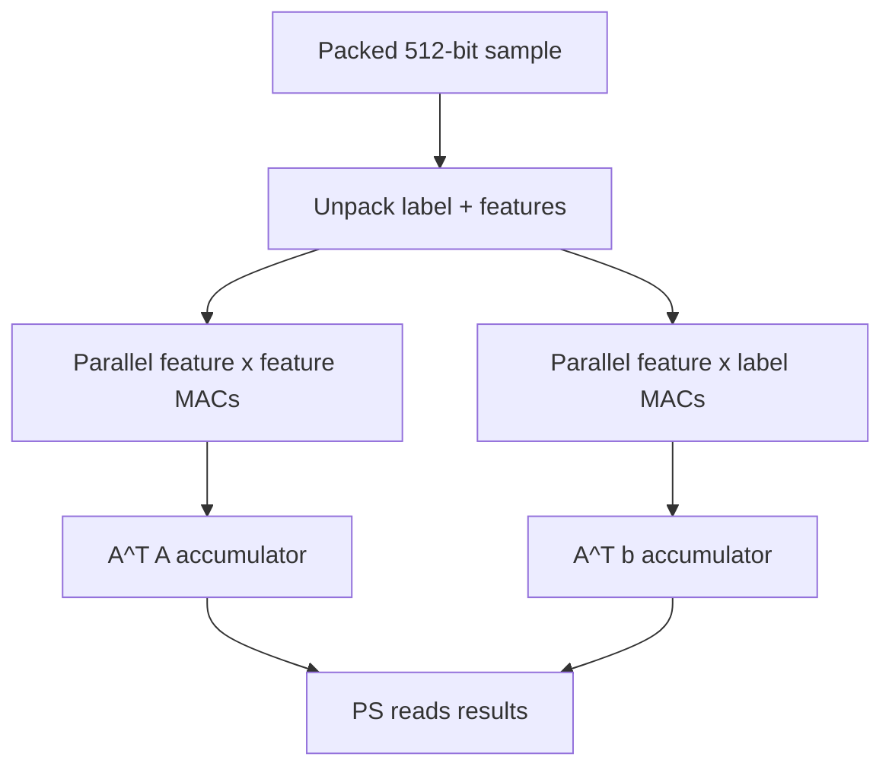

# RTL Linear Regression Accelerator

Public technical dossier for the RTL hardware-acceleration part of a real-time FPGA crypto market-data project.

> This repository documents the FPGA accelerator architecture and validation approach only. The original source, bitstreams, credentials, notebooks, and trading/API code are not published. This is an engineering portfolio project, not financial advice or a deployable trading system.

## Overview

This project accelerated the training step of a streaming linear-regression model on a PYNQ-Z1 FPGA. The trading system computed live market microstructure features in software, then used the FPGA fabric to accelerate the most arithmetic-heavy part of retraining: accumulating the normal-equation matrices.

My work focused on the **RTL hardware acceleration**:

- fixed-point/integer representation for FPGA-friendly arithmetic,
- parallel multiply-accumulate datapath,
- packed sample input format,
- 512-bit AXI-style sample bus,
- 64-bit accumulation to avoid overflow over thousands of samples,
- PYNQ/PS integration for launching the accelerator and reading results,
- hardware/software comparison against NumPy reference implementations.

## Acceleration Target

For each new feature vector `a` and target value `b`, the normal equations can be updated incrementally:

```text
A'T A' = A^T A + a^T a
A'T b' = A^T b + a^T b
```

That means the hardware does not need to store or multiply the entire historical feature matrix each time. It only needs to stream samples and accumulate outer products.



## Key Results

| Metric | Result |
|---|---:|
| Board | PYNQ-Z1 |
| PL clock | 100 MHz |
| Batch size | Approx. 4000 samples |
| Hardware accumulation | Approx. 3.49 ms |
| Optimised software batch | Approx. 30.4 ms |
| Unoptimised software batch | Approx. 8.8573 s |
| Average multiplication latency difference | 18.240x |
| Maximum multiplication latency difference | 68.191x |
| DSP48 use | 170 / 220 |
| LUT use | 21,197 / 53,200 |
| FF use | 21,292 / 106,400 |
| BRAM use | 5.5 / 140 |
| On-chip power | Approx. 2.135 W |
| Timing estimate / target | 5.84 ns / 8 ns |

## Public Evidence

| Topic | Document |
|---|---|
| Accelerator architecture | [`docs/rtl-accelerator.md`](docs/rtl-accelerator.md) |
| Numeric format and packing | [`docs/fixed-point-and-bus.md`](docs/fixed-point-and-bus.md) |
| PYNQ integration | [`docs/pynq-integration.md`](docs/pynq-integration.md) |
| Testing and validation | [`docs/testing-and-validation.md`](docs/testing-and-validation.md) |
| Source policy | [`docs/source-availability.md`](docs/source-availability.md) |
| GitHub setup | [`docs/github-setup.md`](docs/github-setup.md) |

## Technology

- SystemVerilog / RTL hardware design
- FPGA fixed-point/integer arithmetic
- Parallel MAC datapaths
- AXI-style register/memory interfaces
- 512-bit sample packing
- PYNQ-Z1 / Zynq-7000
- Python/PYNQ MMIO integration
- NumPy reference models

## Application Context

The accelerator was integrated into a larger system that streamed Binance market data, computed microstructure features, trained a short-horizon linear model, and evaluated predictions through paper trading. This public repo focuses only on the hardware acceleration layer.

## Safety Boundary

The original archive contains sensitive and non-public material, including credential-like files and bitstreams. This public repository intentionally excludes all implementation source and deployable trading components.

