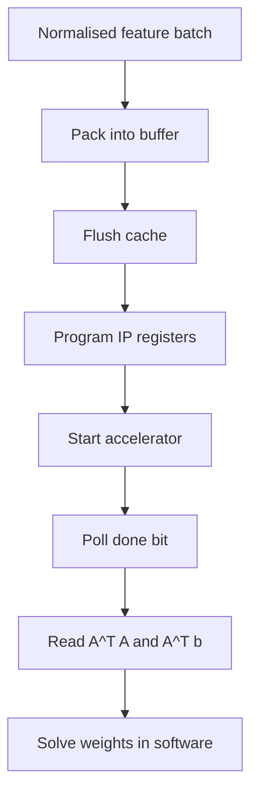

# PYNQ Integration

The accelerator was integrated with the PYNQ processing system so Python could prepare batches, launch the IP, and read back accumulated results.

## PS/PL Flow

## Interface Responsibilities

| Side | Responsibility |
|---|---|
| Processing system | Feature normalisation, integer conversion, buffer packing, register writes, result readback, final solve. |
| Programmable logic | Sample unpacking, parallel multiply-accumulate, accumulator storage, completion signalling. |

## Why Not Put Everything in PL?

The high-value acceleration target was accumulation, not the final matrix inverse/solve. Keeping the final solve on the PS reduced hardware complexity while still removing the dominant repeated MAC workload.

Future work could move Cholesky or QR decomposition into the PL to reduce retraining latency further.

