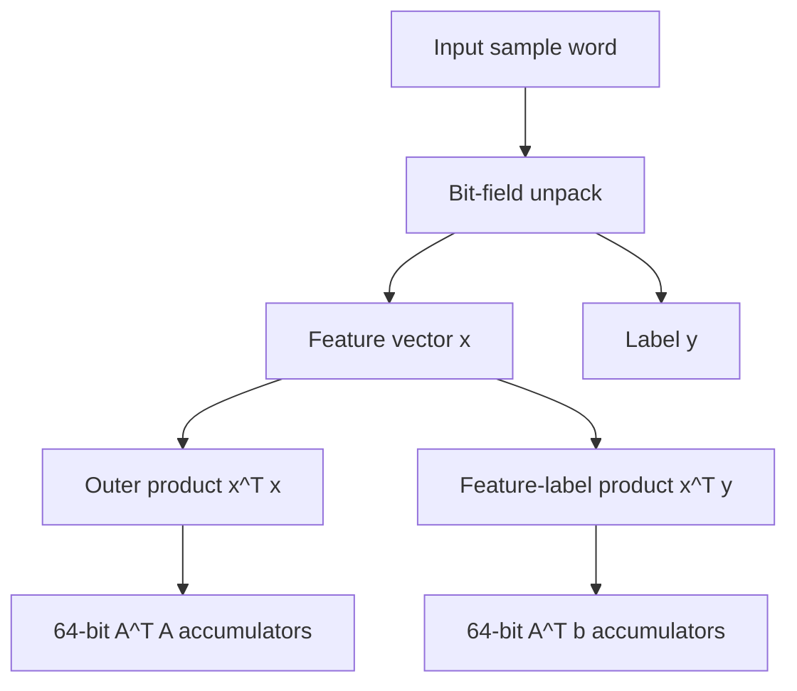

# RTL Accelerator Architecture

The accelerator computes the accumulation terms needed by the normal equations for linear regression:

- `A^T A`
- `A^T b`

The final weight solve is left to the processing system. This split keeps the FPGA focused on the highly parallel multiply-accumulate workload.

## Datapath



## Why This Maps Well to FPGA

Each sample update consists of many independent multiplications:

- feature-by-feature products for `A^T A`,
- feature-by-label products for `A^T b`.

These operations are independent within a sample, so they can be unrolled into parallel DSP-backed MAC units.

## Lower-Triangle Optimisation

For a symmetric `A^T A` matrix, only the lower triangle needs unique computation. For a 17-parameter model, that is:

```text
17 * 18 / 2 = 153
```

unique `A^T A` terms, plus 17 `A^T b` terms. This explains the high DSP use: the design deliberately spends DSP48s to reduce cycle count.

## Processing-System Boundary

The accelerator returns accumulated matrices/vectors. The PS then:

1. reads `A^T A` and `A^T b`,
2. solves for model weights,
3. compares against software references,
4. publishes or uses the updated weights.

This is a practical split because matrix inversion/pseudo-inverse logic is more complex and was not the bottleneck in the implemented design.

